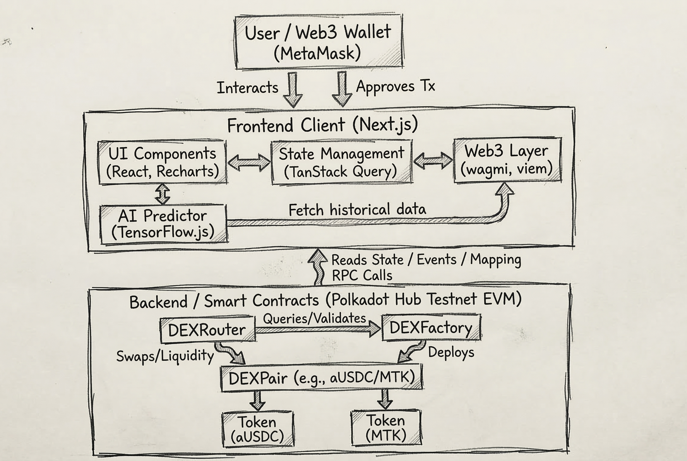

# DEXplorer Architecture

This document outlines the high-level architecture of the DEXplorer Decentralized Exchange (DEX) Analytics Dashboard.

## System Architecture Diagram

## Core Components

### 1. Frontend Layer
- **UI Components:** Built with React 19 and Next.js App Router for rapid rendering. Uses Framer Motion for animations and Recharts for analytics data visualization (TVL, Impermanent loss, etc.).
- **Web3 Interface:** Integrates `wagmi` and `viem` to handle wallet connections, network switching, transaction signing, and fetching on-chain data directly via RPC.
- **AI Predictor:** Uses `TensorFlow.js` in the browser to process swap histories and provide short-term price predictions using linear regression models.
- **State Management:** Uses `TanStack React Query` to efficiently cache and refetch blockchain state and RPC responses.

### 2. Smart Contract Layer (AMM)
- **DEXRouter:** The primary entry point for users interacting with the DEX. It includes safety mechanisms like slippage protection and deadline expiration flags, routing swap exact token transactions logically.
- **DEXFactory:** Responsible for deploying new `DEXPair` instances and maintaining a registry of all active pairs.
- **DEXPair:** The core Automated Market Maker (AMM) logic based on the `x * y = k` invariant. It manages the reserves of two ERC-20 tokens, determines pricing during a swap, and handles liquidity minting/burning (LP tokens).
- **ERC-20 Tokens:** Standard mock implementations for bridged assets (`aUSDC`) and native tokens (`MTK`) traded within the ecosystem.

### 3. Blockchain Network
- Deployed on **Polkadot Hub Testnet** utilizing an Ethereum Virtual Machine (EVM) compatible layer, ensuring standard Solidity and EVM toolchain (Hardhat, viem) support.
